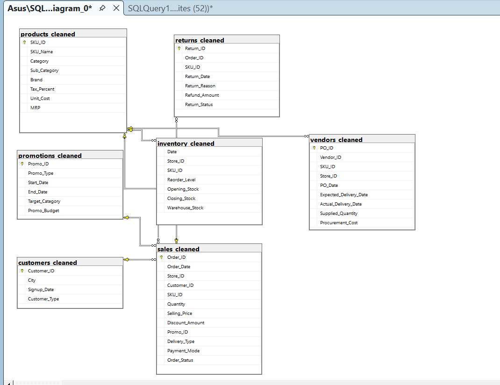

# Retail Profit Leakage & Demand Optimization Analysis

## Overview

Retail businesses often focus on increasing sales, but sustainable growth depends on protecting profitability. This project analyzes sales, inventory, returns, vendor performance, promotions, and customer behavior to identify hidden sources of profit leakage and uncover opportunities for operational optimization.

Using SQL, Power BI, Tableau, Python, and Excel, this project transforms raw retail data into actionable business insights and strategic recommendations.

---

## Business Problem

Despite generating significant revenue, the retail chain experienced lower-than-expected profitability. The objective of this analysis was to investigate where profits were being lost and identify practical solutions to improve business performance.

### Key Questions Addressed

* Where is profit leaking across the retail operation?
* How much revenue is lost through discounts, returns, and operational inefficiencies?
* Which vendors, stores, and product categories contribute most to leakage?
* How can inventory and demand planning be optimized?
* How can profitability be improved without increasing sales volume?

---

## Project Objectives

* Identify major sources of profit leakage
* Analyze return and refund patterns
* Evaluate promotion effectiveness
* Assess vendor delivery performance
* Detect inventory stockouts and low-stock risks
* Build an executive-level analytics dashboard
* Develop actionable business recommendations

---

## Tools & Technologies

| Category        | Tools                   |
| --------------- | ----------------------- |
| Database        | SQL Server              |
| Analytics       | Python                  |
| Visualization   | Power BI, Tableau       |
| Data Processing | Excel                   |
| Reporting       | PowerPoint, PDF Reports |

---

## Dataset Overview

The project integrates multiple retail datasets to provide a complete view of business performance.

| Dataset    | Description                                |
| ---------- | ------------------------------------------ |
| Sales      | Customer transactions and revenue analysis |
| Products   | Product cost and category analysis         |
| Inventory  | Stock availability and inventory movement  |
| Returns    | Return and refund analysis                 |
| Vendors    | Procurement and delivery performance       |
| Customers  | Customer behavior analysis                 |
| Promotions | Promotion effectiveness analysis           |

### Project Scale

* 74,372 Orders
* 15,011 Customers
* 1,201 Products
* 200 Stores
* 30,000 Purchase Orders

---

## Data Model

The project uses a relational data model connecting sales, products, inventory, vendors, returns, promotions, and customers to enable end-to-end retail analytics.

### Entity Relationship Diagram



---

## Dashboard Preview

> Add your dashboard screenshots here after uploading them.

```text
Example:


```

---

## Key Performance Metrics

| Metric                | Value   |
| --------------------- | ------- |
| Gross Sales           | ₹26.24M |
| Net Sales             | ₹22.58M |
| Gross Profit          | ₹3.58M  |
| Gross Margin          | 15.86%  |
| Discount Leakage      | ₹3.67M  |
| Return Rate           | 6.20%   |
| Refund Leakage        | ₹1.64M  |
| On-Time Delivery Rate | 69.63%  |
| Stockout Events       | 1,292   |
| Low Stock Records     | 11,365  |

---

## Key Findings

### Discount Leakage

* ₹3.67M lost through discounting strategies
* Excessive discounts significantly reduced profitability
* Several promotions generated revenue but failed to improve margins

### Return & Refund Leakage

* Return Rate: 6.2%
* Refund Leakage: ₹1.64M

Primary return drivers:

* Quality Issues
* Damaged Products
* Late Deliveries
* Wrong Item Shipments

### Vendor Performance Issues

* On-Time Delivery Rate: 69.63%
* Nearly 30% of deliveries arrived late

Business impact:

* Increased stockouts
* Customer dissatisfaction
* Higher return rates
* Lost sales opportunities

### Inventory Blind Spots

Analysis identified:

* 1,292 Stockout Events
* 11,365 Low-Stock Records

Inventory shortages directly impacted revenue generation and customer experience.

### Promotion Effectiveness

Several promotional campaigns increased sales volume but reduced overall profitability.

**Key Insight:** Promotional campaigns should be evaluated based on profit contribution rather than revenue generation alone.

---

## Analytics Workflow

```text
Raw Data Collection
        ↓
Data Cleaning
        ↓
SQL Analysis
        ↓
KPI Engineering
        ↓
Business Insights
        ↓
Tableau Visualization
        ↓
Power BI Dashboard
        ↓
Strategic Recommendations
```

---

## Dashboard Features

The Power BI and Tableau dashboards provide:

* Profit Leakage Monitoring
* Sales Performance Analysis
* Return & Refund Tracking
* Vendor Performance Monitoring
* Inventory Risk Analysis
* Promotion Effectiveness Evaluation
* Store Performance Benchmarking
* Executive KPI Reporting

---

## Business Recommendations

### Vendor SLA Enforcement

Implement vendor scorecards and delivery compliance monitoring to reduce late deliveries.

### Dynamic Inventory Planning

Automate reorder alerts and maintain optimal stock levels to reduce stockouts.

### Promotion Optimization

Focus promotional campaigns on high-margin products and profitable customer segments.

### Quality Control Improvements

Strengthen supplier quality checks to reduce returns caused by product defects.

### Demand Forecasting

Use historical sales patterns to improve inventory planning and demand management.

### Data Quality Governance

Implement stronger controls to ensure accurate and complete operational reporting.

---

## Business Impact

### Leakage Identified

* ₹3.67M Discount Leakage
* ₹1.64M Refund Leakage
* 1,292 Stockout Events
* 30% Vendor Delay Rate

### Potential Benefits

* Improved Profit Retention
* Reduced Refund Costs
* Better Inventory Availability
* Enhanced Customer Satisfaction
* Stronger Supply Chain Performance
* Increased Operational Efficiency

---

## Repository Structure

```text
Retail-Profit-Leakage-Analysis
│
├── README.md
├── Retail_Profit_Leakage_Dashboard.pbix
├── Retail_Profit_Leakage_Analysis.sql
├── Data_Cleaning_and_Analysis.ipynb
├── Retail_Data_Model.png
├── Retail_Profit_Leakage_Short_Executive_Summary.pdf
├── tableau.twbx
├── customers_cleaned.xlsx
├── inventory_cleaned.xlsx
├── products_cleaned.xlsx
├── returns_cleaned.xlsx
└── vendors_cleaned.csv
```

---

## Skills Demonstrated

* SQL Querying
* Data Cleaning & Transformation
* Relational Data Modeling
* Business Intelligence
* KPI Development
* Dashboard Design
* Data Visualization
* Retail Analytics
* Supply Chain Analytics
* Inventory Optimization
* Root Cause Analysis
* Business Problem Solving

---

## Author

### Bandi Hitesh

**Associate Data Analyst**

---

## Conclusion

> "The retail chain does not have a sales problem. It has a profit retention problem."

This project demonstrates how analytics can move beyond reporting and become a strategic decision-making tool by identifying, quantifying, and addressing profit leakage across retail operations. By integrating SQL, Power BI, Tableau, Python, and Excel, the analysis uncovers actionable opportunities to improve profitability, optimize inventory management, strengthen vendor performance, and drive data-informed business decisions.
